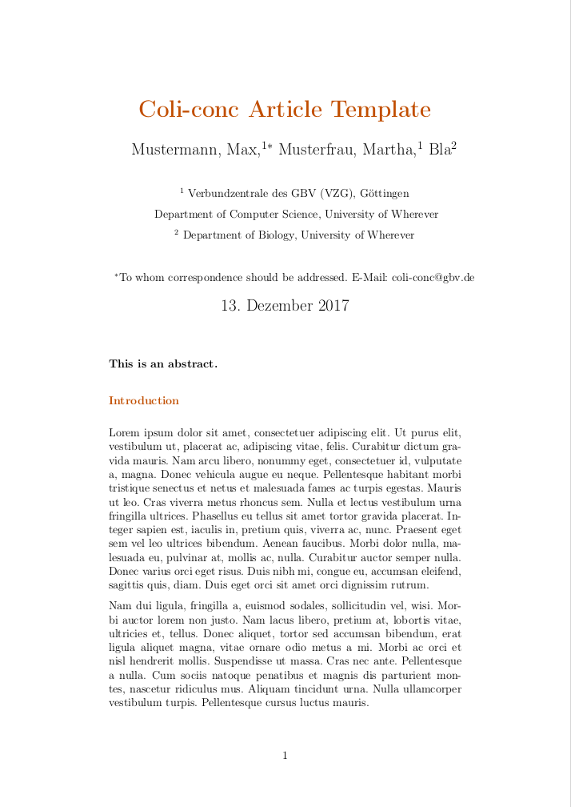
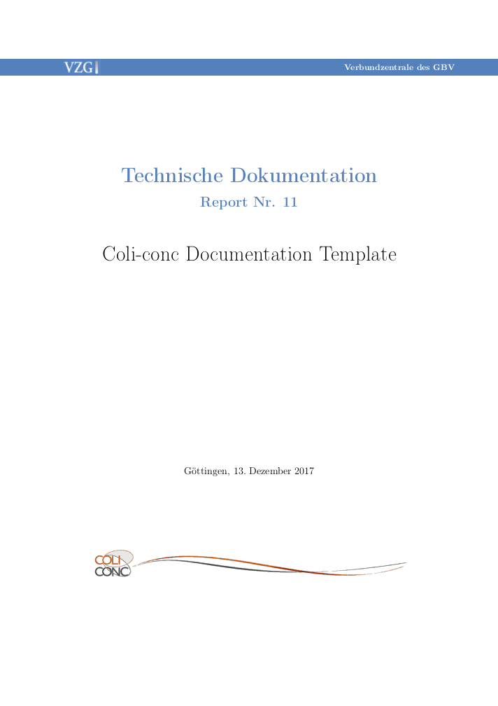
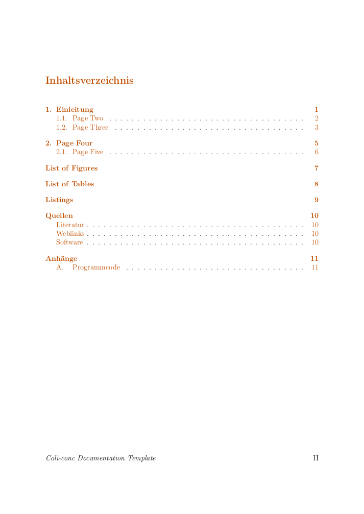

# Instruction on how to use the Coli-conc TeX Template
<!-- Table of Contents Begin-->
- [Introduction](#introduction)
  - [Installing LaTeX](#installing-latex)
    - [Linux](#linux)
    - [Windows](#windows)
    - [Mac OS](#mac-os)
- [Directory Structure](#directory-structure)
- [Meaning of Files](#meaning-of-files)
  - [Main Directory](#main-directory)
    - [README](#readme)
    - [bspdok-coliartcl.pdf](#bspdok-coliartcl)
    - [bspdok-colidok.pdf](#bspdok-colidok)
    - [bspdok-colireport.pdf](#bspdok-colireport)
    - [bsptexte.tex](#bsptexte)
    - [coliartcl.tex](#coliartcl-tex)
    - [colidok.tex](#colidok-tex)
    - [colireport.tex](#colireport-tex)
  - [basics/ Directory](#basics-directory)
    - [coli-conc-wave.jpg](#coli-conc-wave)
    - [vzg.png](#vzg)
    - [bibliography.bib](#bibliography)
    - [input.tex](#input)
    - [setup.tex](#setup)
    - [setup-allg.tex](#setup-allg)
    - [setup-colidok.tex](#setup-colidok)
  - [documentation/ Direcoty](#documentation-directory)
  - [figures/ Directory](#figures-directory)
    - [kafka.jpg](#kafka)
  - [styles/ Directory](#styles-directory)
    - [coliartcl.cls](#coliartcl-cls)
    - [colidok.cls](#colidok-cls)
    - [colireport.cls](#colireport-cls)
- [How to start](#how-to-start)
  - [Writing an Article](#writing-an-article)
  - [Writing a Documentation](#writing-a-documentation)
  - [Writing a Report](#writing-a-report)
  - [Alter Standard Information](#alter-standard-information)
  - [Add Figures](#add-figures)
  - [Add Tables](#add-tables)
    - [Alter Tables](#alter-tables)
  - [Add Listings](#add-listings)
    - [Alter Listings](#alter-listings)
  - [Add Bibliography Entries](#add-bibliography-entries)
    - [Citing](#citing)
  - [Using Acronyms](#acronyms)
  - [Glossary](#glossary)
- [Useful Links](#useful-links)
<!-- Table of Contents End-->


# Introduction
This directory contains the files needed to produce the Coli-conc-style PDF files using TeX.

## Installing Latex

### Linux
The most important TeX distribution is [TeX Live](http://www.tug.org/texlive/) which is provided on the [website](http://www.tug.org/texlive/acquire-netinstall.html). Nevertheless the most common way of installing it is via the paket manager of your Linux distribution. For Debian-based systems like Ubuntu the CLI commands would be
```
sudo apt-get install texlive texlive-lang-german texlive-latex-extra
```
to install the complete TeX-system, the German language files and some extra packages or
```
sudo apt-get install texlive-base
```
to install TeX fully, which means the download of a couple of hundreds megabyte.

For other distributions just google the name of your distribution with ```latex installation```. E.g. the German [Ubuntu Wiki](https://wiki.ubuntuusers.de/TeX_Live/) provides these information too.
The TeX Live documentation can be found [here](http://www.tug.org/texlive/doc.html).

### Windows
A common TeX distribution for Windows systems is [MiKTeX](https://miktex.org/). They provide an exe-file in the [download section of the website](https://miktex.org/download).
There is also
  - a [Tutorial](https://miktex.org/howto/install-miktex),
  - a [Manual](https://docs.miktex.org/2.9/manual/) and
  - a [FAQ](https://docs.miktex.org/faq/).

### Mac OS
Please follow the instructions at [Mac TeX](http://tug.org/mactex/).

# Directory Structure
```
coli-tex-template
│   README.md
│   bsptexte.tex
│   coliartcl.tex
│   colidok.tex
    colireport.tex
│
└───basics/
│   │   coli-conc-wave.png
│   │   vzg.png
│   │   bibliography.bib
│   │   input.tex
│   │   setup.tex
│   │   setup-allg.tex
│   │   setup-colidok.tex
│
└───documentation/
│   │   bspdok-coliartcl.pdf
│   │   bspdok-colidok.pdf
│   │   coliartcl-screenshot.png
│   │   colidok-content-screenshot.png
│   │   colidok-main-screenshot.png
│
└───figures/
│   │   kafka.jpg
│
└───styles/
    │   coliartcl.cls
    │   colidok.cls
        colireport.cls
```

# Meaning of Files
## Main Directory
### README
[This file you are currently reading](README.md).

### bsptexte
File with random text snippets to fill the [bspdok-colidok.tex](bspdok-colidok.tex) with life. The basic document structure can be seen here (```chapter```, ```section``` and ```subsection```). It also shows how to include figures, tables and source code listings which are explained to detail in [Add Figures](#add-figures), [Add Tables](#add-tables) and [Add Listings](#add-listings).

### coliartcl-tex
To make an article like document as shown in [bspdok-coliartcl.pdf](bspdok-coliartcl.pdf) the [coliartcl.tex](coliartcl.tex) file is used. It is based on the [KOMA (German)](https://komascript.de/) class [scrartcl](https://ctan.org/pkg/scrartcl).

### colidok-tex
To make a more thesis like document like a documentation as shown in [bspdok-colidok.pdf](bspdok-colidok.pdf) the [colidok.tex](colidok.tex) file is used. It is based on the [KOMA (German)](https://komascript.de/) class [scrbook](https://ctan.org/pkg/scrbook).

### colireport-tex


## basics Directory
Contains the relevant files (setup, figures and bibliography) to generate the documents.

### coli-conc-wave


### vzg


### bibliography
The file [bibliography.bib](basics/bibliography.bib) contains the BibTeX formatted information about publications.

### input
The file [input.tex](basics/input.tex) contains the information that has to be altered by the user. These parts are beginning with ```% FIXME```.

### setup
The file [setup.tex](basics/setup.tex) contains the information about the used packages.
- Also the Listings are defined here which can be altered.
<span style="color:red">**(Should be moved to [input.tex](basics/input.tex)).**</span>

### setup-allg
The file [setup-allg.tex](basics/setup-allg.tex) contains all packages that are needed for both templates.
- <span style="color:red">**(Should be moved to [setup.tex](basics/setup.tex)).**</span>

### setup-colidok
The file [setup-colidok.tex](basics/setup-colidok.tex) contains additional definitions and packages that are needed for the documentation style template. The part in the *Header and Footer* section of the file that is marked with ```% FIXME``` needs to be altered.
- Multibib <span style="color:red">**(Should be removed).**</span>
- Header and Footer <span style="color:red">**(Should be moved to [input.tex](basics/input.tex)).**</span>


##  documentation Directory
Contains the files that are used in this documentation (e.g. Screenshots). Not relevant for the using of the TeX files.

### bspdok-coliartcl
Generated example [PDF](documentation/bspdok-coliartcl.pdf) from the [coliartcl.tex](coliartcl.tex).


### bspdok-colidok
Generated example [PDF](documentation/bspdok-colidok.pdf) from the [colidok.tex](colidok.tex).



### bspdok-colireport


## figures Directory
Currently contains the example file of Franz Kafka ([kafka.jpg](figures/kafka.jpg)) and is intended to store all used figures from a document to keep the main directory clearly arranged.
It is not mandatory to use it.

## styles Directory
### coliartcl-cls
The file [coliartcl.cls](styles/coliartcl.cls) is the class file that controls the definition and design of the Coli-conc article template. It is based on the [KOMA (German)](https://komascript.de/) class [scrartcl](https://ctan.org/pkg/scrartcl).

### colidok-cls
The file [colidok.cls](styles/colidok.cls) is the class file that controls the definition and design of the Coli-conc documentation template. It is based on the [KOMA (German)](https://komascript.de/) class [scrbook](https://ctan.org/pkg/scrbook).

### colireport-cls

***

# How to start
A general good start on using LaTeX can be found on Wikibooks:
- [German Version](https://de.wikibooks.org/wiki/LaTeX-Kompendium)
- [English Version](https://en.wikibooks.org/wiki/LaTeX)

You may need to install it on your machine and general information about this can be found [here](https://www.latex-project.org/get/).

There are many editors for LaTeX, so you will find some by googling for it. [TeXStudio](https://www.texstudio.org/) is a very good start and available for various Windows, Linux, OS/2 and MacOS operating systems from the [download page](https://www.texstudio.org/#download).

## Writing an Article


## Writing a Documentation


## Writing a Report


## Alter Standard Information
The file [input.tex](basics/input.tex) contains the information that has to be altered by the user. These parts are beginning with ```% FIXME```.

If you use the documentation template you need to alter the *Header and Footer* information in [setup-colidok.tex](basics/setup-colidok.tex) that is marked with ```% FIXME```.


## Add Figures
```
\begin{figure}[tbph]
	\centering
	\includegraphics[width=0.7\linewidth]{./figures/kafka}
	\caption[Kafka]{Portrait von Franz Kafka}
	\label{fig:kafka}
\end{figure}
```

## Add Tables
```
\begin{table}
	\centering
	\begin{tabular}{lll}
		\textbf{Überschrift 1} & \textbf{Überschrift 2} & \textbf{Überschrift 3} \\
		A & B & C \\
		1 & 2 & 3 \\
		a & b & c \\
		i & ii & iii \\
	\end{tabular}
	\caption{Eine dreispaltige Tabelle}
	\label{tab:threecols}
\end{table}
```
### Alter Tables

## Add Listings
```
\begin{lstlisting}[language=Java, caption=Java example, label=lst:java]
class Hallo {
  public static void main( String[] args ) {
    System.out.print("Hallo Welt!");
  }
}
\end{lstlisting}
```
### Alter Listings


## Add Bibliography Entries
Conversion into BibTeX entries can be done using an online tool like the [BibTeX Online Editor](http://truben.no/latex/bibtex/) or [arXiv To BibTex](https://arxiv2bibtex.org/).

If you are using [Citavi](https://www.citavi.com/), [Zotero](https://www.zotero.org/) or [Mendeley](https://www.mendeley.com/) just consult their manuals on how to export the BibTeX entries from there.
- [Citavi Manual Page (English)](https://service.citavi.com/kb/a374/70001-your-support-options.aspx)
- [Citavi Manual Page (German)](https://service.citavi.com/kb/a373/70001-citavi-support-angebote.aspx)
- [Zotero Manual Page (English)](https://www.zotero.org/support/)
- [Zotero Manual Page (German)](https://www.zotero.org/support/de/start)
- [Mendeley Maual Page (English)](https://www.mendeley.com/guides)

Publisher like Springer offer these BibTeX entries on their websites like on [Springer Link](https://link.springer.com), some libraries offer these entries too.


## Acronyms
Package Glossary

## Glossary
Package Glossary

***

## Useful Links
- [Wikibooks: LaTeX-Kompendium (deutsch)](https://de.wikibooks.org/wiki/LaTeX-Kompendium)
- [Wikibooks: LaTeX (english)](https://en.wikibooks.org/wiki/LaTeX)
- [The LaTeX Project](https://www.latex-project.org/)
- [The LaTeX Project User Guide (PDF)](https://www.latex-project.org/help/documentation/usrguide.pdf)
- [TeX - LaTeX Stack Exchange](https://tex.stackexchange.com/)
- [Citavi (deutsch)](https://www.citavi.com/de/)
- [Citavi (english)](https://www.citavi.com/de/)
- [Mendeley](https://www.mendeley.com/)
- [Zotero](https://www.zotero.org/)
