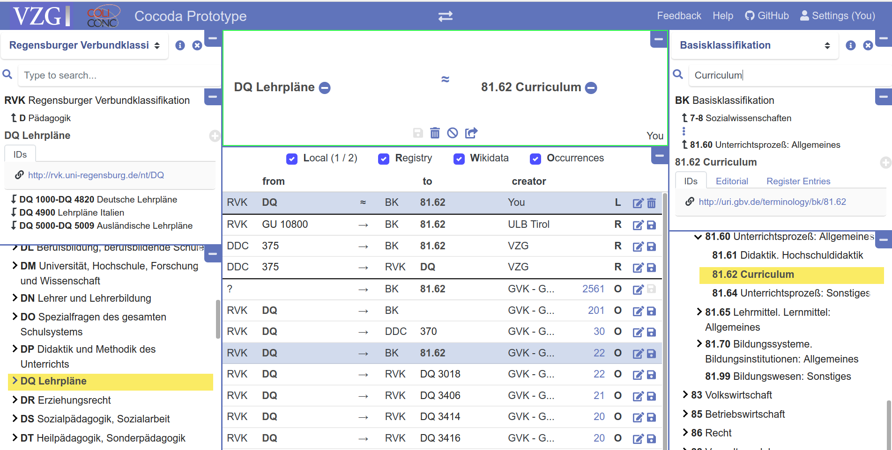

# Projekt coli-conc

* **DFG-Projekt** an der Verbundzentrale des GBV\
  (Dezember 2015 -- April 2019)

* **Konkordanz-Datenbank**\
  382\.982 Mappings DDC/RVK/GND/BK/...\
  142\.502 Mappings RVK $\rightarrow$ DDC/GND/BK\
  \(3.6 Mio Mappings Wikidata $\rightarrow$ ...) 

* **Webanwendung Cocoda** zum Mapping verschiedener
  Klassifikationen, Normdateien, etc.

# Mapping-Tool Cocoda

# Mapping-Tool Cocoda

* Open Source Webanwendung (Chrome / Firefox)

* Einbindung per API auch in anderem Kontext

* <https://gbv.github.io/cocoda/dev/> (Entwicklungsversion) \
  <https://coli-conc.gbv.de/cocoda/> (Releases)

# Nächste Meilensteine

1. Bessere Mapping-Empfehlungen

2. Nutzerverwaltung (bisher nur lokal im Browser) 

3. Auswertung (Mapping-Abdeckung, Konsistenz...)

4. Eintragung fehlender BK im GBV/SWB-Katalog\
  (RVK-BK-Mappings)

# Mitmachen

*Wir brauchen Feedback auf Basis tatsächlicher Mapping-Versuche!*

<https://coli-conc.gbv.de>

* Screencast-Kurzeinführung (3 Minuten)\
  <https://vimeo.com/296616305>

* Was kann verbessert werden?

* Schicken Sie uns Ihre Kommentare und Mappings!^[Die VZG erstellt keine Mappings sondern sammelt, verarbeitet, wertet aus und stellt bereit.]

