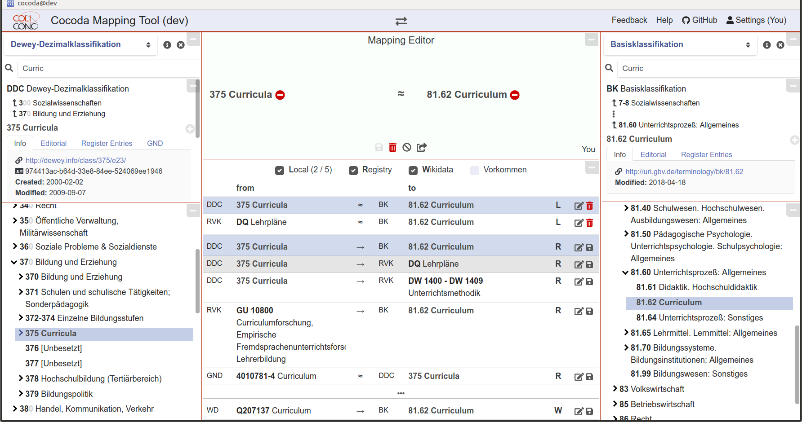

# Mappings

"Same" resources with multiple URIs

* `<apples> owl:sameAs <oranges>`

Mapping relation types in SKOS

* **=** \ \ \ `skos:exactMatch`
* **≈** \ \ \ `skos:closeMatch`
* **~** \ \ \ `skos:relatedMatch`
* **>** \ \ \ `skos:broadMatch`
* **<** \ \ \ `skos:narrowMatch`

# Mapping metadata

<!-- Information about individual mapping statements -->

* Concordance (e.g. VIAF-Wikidata)
* Provenance (creator, date...)
* Matching method, determinacy...

. . .

**Implementation**

* RDF Reification --- *SRSLY!?* 
* JSKOS data format (mostly SKOS in JSON-LD)

# Mapping management

**Collection of concordances**

* 382\,982 mappings DDC/RVK/GND/BK/...
* 142\,502 mappings RVK $\rightarrow$ DDC/GND/BK
* 3,6 M mappings Wikidata $\rightarrow$ ...

\hfill

*CC0 via API & download --- please use the data!*

<https://coli-conc.gbv.de/concordances/>

# Mapping management

**Cocoda web application**

* browse classifications, thesauri, and authority files
* inspect and create mappings

\hfill

*Open Source (MIT), JavaScript (Vue) --- try out, give feedback!*

<https://gbv.github.io/cocoda/dev/>

---

